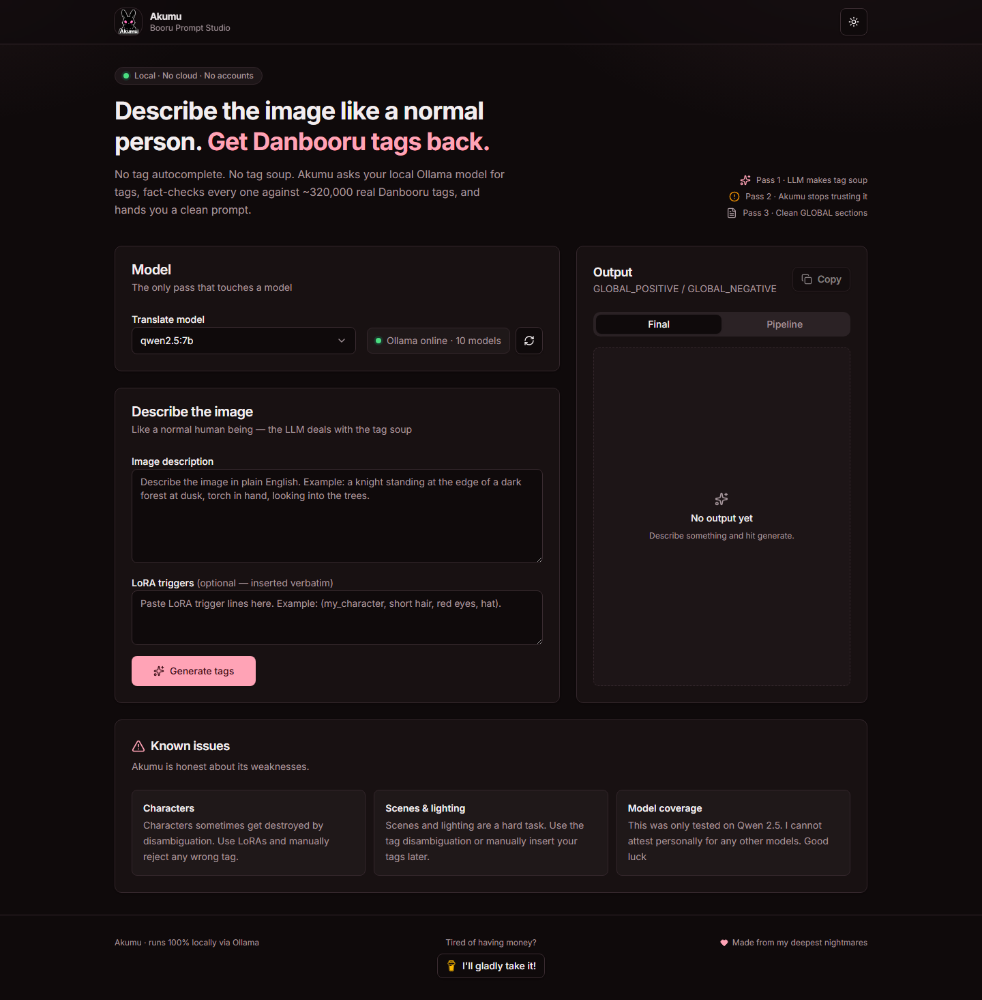
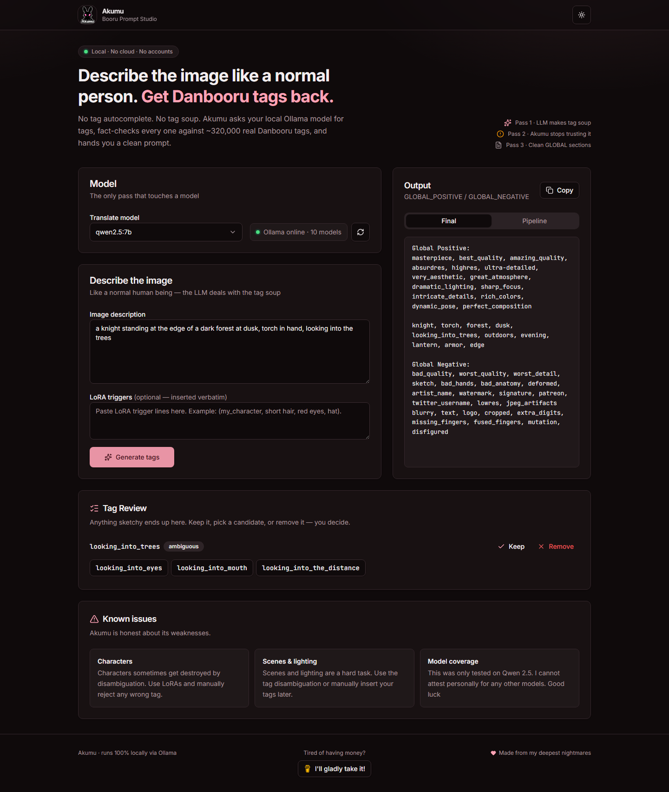

# <div align="center">Akumu</div>

<div align="center">

### *Describe the image like a normal human being.*

### *Get Danbooru tags back.*

### *Without sacrificing your sanity to tag autocomplete.*

<br>


<br>


<br>

<a href="https://buymeacoffee.com/waypointnull">

</a>

</div>

---

<div align="center">

## What it looks like

</div>

<div align="center">



*Empty state. Judging you for not having typed anything yet.*

<br>
<br>



*After a prompt. The tag review is on the right, being suspicious of the LLM's choices.*

</div>

---

<div align="center">

## Why?

Because manually writing Danbooru prompts is a special kind of misery.

I wanted to describe an image like a normal person...

...and let a local LLM deal with the tag soup.

Then I made the mistake of caring whether the output was actually *good.*

So now Akumu has an entire validation pipeline whose sole purpose is looking at whatever the LLM just said and going:

> *"...you sure about that?"*

</div>

---

<div align="center">

## What this stupid thing actually does

</div>

You write something like:

> *"Neeko from League of Legends sitting on a rock in a jungle, looking confused at the viewer."*

Akumu asks your **local Ollama model** to translate that into Danbooru tags.

Then...

...it immediately stops trusting the AI.

Every generated tag gets checked against a real Danbooru tag database with **320,000+ tags**.

Aliases get resolved.

Compound tags get fixed.

Typos get corrected.

Anything suspicious gets thrown into **Tag Review** so *you* decide what happens instead of letting the LLM freestyle.

Finally, everything gets formatted into:

```text
GLOBAL_POSITIVE

GLOBAL_NEGATIVE
```

Ready to paste into whatever image generation workflow you're using.

> [!NOTE]
> Everything runs locally.
>
> No cloud.
>
> No accounts.
>
> No API keys.
>
> No telemetry.
>
> Just your machine doing the work.

---

<div align="center">

## Stuff it does

</div>

* 🧠 **Natural language → Danbooru tags.**
* ✅ **Fact-checks the LLM** against ~320k real tags.
* 🔍 **Tag Review** for anything questionable. 
   * 🔞 **No Censorship** no, it doesn't censor you from NSFW. I'm an adult content creator, for fuck's sake.
* 🎯 **LoRA trigger support.**
* 📋 **One-click copy** because selecting text is exhausting.
* 🟢 **Live Ollama status** so you know whether it's actually alive.
* 📦 Works entirely offline after setup.

---

<div align="center">

## How the magic works

*(It's actually mostly paranoia.)*

</div>

```text
You write:

    "Neeko sitting on a rock looking confused."

                │
                ▼

LLM translates English into Danbooru tags.

                │
                ▼

Akumu immediately stops trusting the LLM.

                │
                ▼

Every tag gets checked against
the real Danbooru tag database.

                │
                ▼

Anything sketchy goes into
Tag Review.

                │
                ▼

GLOBAL_POSITIVE

GLOBAL_NEGATIVE
```

The AI only gets **one** job.

Everything after that is deterministic.

Because LLMs hallucinate.

Frequently.

---

<div align="center">

## Before you complain it doesn't work

</div>

You'll need:

* Node.js 18+
* Ollama
* Literally any Ollama model

For example:

```powershell
ollama pull qwen2.5:7b
```

---

<div align="center">

## Install it

*No CMD required. I checked.*

</div>

Head to the [Releases](https://github.com/WaypointNull/Akumu/releases) tab.

Download the latest setup, double-click it, done.

* `Akumu-Setup-x.x.x.exe` — one-click installer. Gives you a proper app with a desktop shortcut. This is the one normal people want.
* `Akumu-Portable-x.x.x.exe` — no install. Download, run, delete when you're done. Great for USB sticks and suspicious machines.

Either way it lives in your taskbar, opens and closes like a real app, and keeps running quietly in the tray.

You still need **Ollama** running with a model pulled:

```powershell
ollama pull qwen2.5:7b
```

That's the whole setup.

...

Maybe I should make a one-click pull button?

Nah. Skill issue.

---

<div align="center">

## Go do the thing

</div>

```powershell
npm install
npm run build
npm start
```

Then open:

```
http://127.0.0.1:5177
```

Congratulations.

You now have another localhost tab you'll forget to close.

---

### First startup

Akumu downloads the Danbooru tag list the first time it runs.

It's around **320,000 tags.**

So yes...

...the first launch takes a minute.

No, it's not frozen.

---

<div align="center">

## Random tips

</div>

* Baseline quality tags are always included.
* Only `GLOBAL_POSITIVE` and `GLOBAL_NEGATIVE` end up in the final output.
* If something looks weird, Tag Review exists for a reason.

---

<div align="center">

## If you insist on reading the code

</div>

```powershell
npm run dev
```

Runs:

* Express backend
* Vue dev server
* Proxy setup
* The usual web development ritual

Useful commands:

| Command          | Does the thing                        |
| ---------------- | ------------------------------------- |
| `npm test`       | Makes sure I didn't break everything. |
| `npm run lint`   | Complains about my formatting.        |
| `npm run format` | Makes Prettier win the argument.      |
| `npm run bench`  | Benchmarks the tag resolver.          |

---

## Where everything lives

```text
server/
    Backend.
    The actual brain.

client/
    Pretty buttons.

scripts/
    Tiny utilities because typing long commands sucks.

data/
    Home of an absolutely enormous Danbooru tag list.
```

---

<div align="center">

## It broke.

</div>

**Akumu says Ollama is offline.**

Is Ollama running?

Seriously.

That's almost always it.

Hit **Refresh Models** afterwards.

---

**The model list is empty.**

You forgot to download one.

```powershell
ollama pull qwen2.5:7b
```

Then refresh.

---

**Nothing happens when I press Run.**

Believe it or not...

...you need to actually type something first.

---

**First launch is taking forever.**

It's downloading hundreds of thousands of tags.

Give it a minute.

---

**Port 5177 is already being used.**

Change `PORT` in:

```text
server/src/config/constants.js
```

---

<div align="center">

## License

WaypointNull Community License v1.0

Use it.

Fork it.

Modify it.

Just don't make money off my suffering.

</div>
